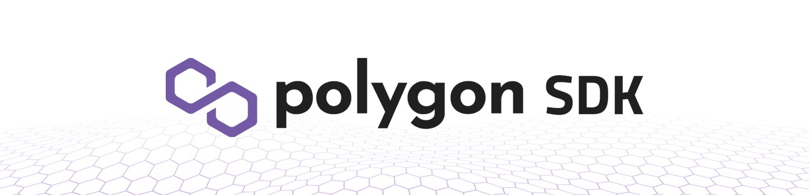

## Polygon Edge

Polygon Edge is a modular and extensible framework for building Ethereum-compatible blockchain networks.

This repository is the first implementation of Polygon Edge, written in Golang. Other implementations, written in other programming languages might be introduced in the future. If you would like to contribute to this or any future implementation, please reach out to [Polygon team](mailto:contact@polygon.technology).

To find out more about Polygon, visit the [official website](https://polygon.technology/).

WARNING: This is a work in progress so architectural changes may happen in the future. The code has not been audited yet, so please contact [Polygon team](mailto:contact@polygon.technology) if you would like to use it in production.

## Documentation 📝

If you'd like to learn more about the Polygon Edge, how it works and how you can use it for your project,
please check out the **[Polygon Edge Documentation](https://sdk-docs.polygon.technology)**.

There, you will find the most up to date information regarding potential features, as well as future roadmaps for the Edge.