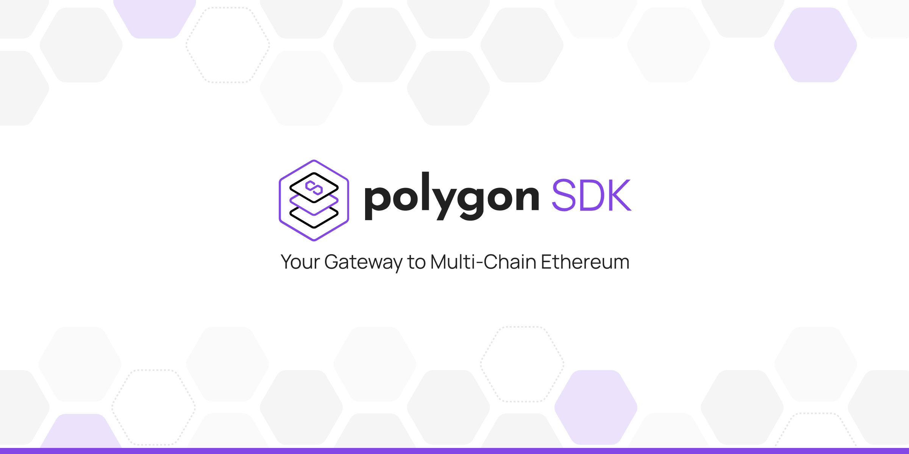

## Polygon SDK

Polygon SDK is a modular and extensible framework for building Ethereum-compatible blockchain networks.

This repository is the first implementation of Polygon SDK, written in Golang. Other implementations, written in other programming languages might be introduced in the future. If you would like to contribute to this or any future implementation, please reach out to [Polygon team](mailto:contact@polygon.technology).

To find out more about Polygon, visit the [official website](https://polygon.technology/).

WARNING: This is a work in progress so architectural changes may happen in the future. The code has not been audited yet, so please contact [Polygon team](mailto:contact@polygon.technology) if you would like to use it in production.

## Documentation 📝

If you'd like to learn more about the Polygon SDK, how it works and how you can use it for your project,
please check out the **[Polygon SDK Documentation](https://sdk-docs.polygon.technology)**.

There, you will find the most up to date information regarding potential features, as well as future roadmaps for the SDK.

---

Copyright 2022 Polygon Technology

Licensed under the Apache License, Version 2.0 (the "License");
you may not use this file except in compliance with the License.
You may obtain a copy of the License at

       http://www.apache.org/licenses/LICENSE-2.0

Unless required by applicable law or agreed to in writing, software
distributed under the License is distributed on an "AS IS" BASIS,
WITHOUT WARRANTIES OR CONDITIONS OF ANY KIND, either express or implied.
See the License for the specific language governing permissions and
limitations under the License.