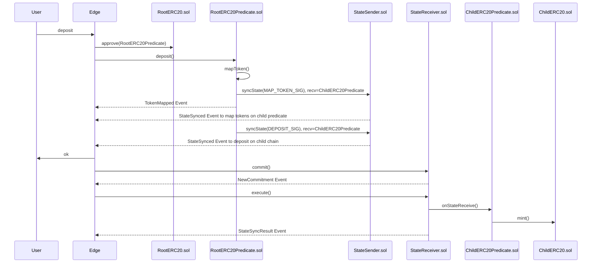
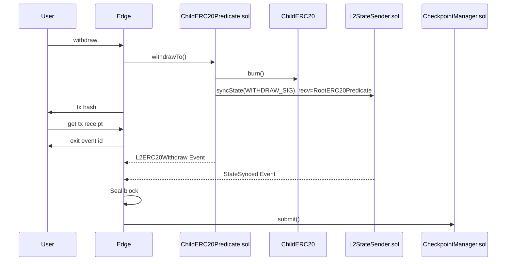
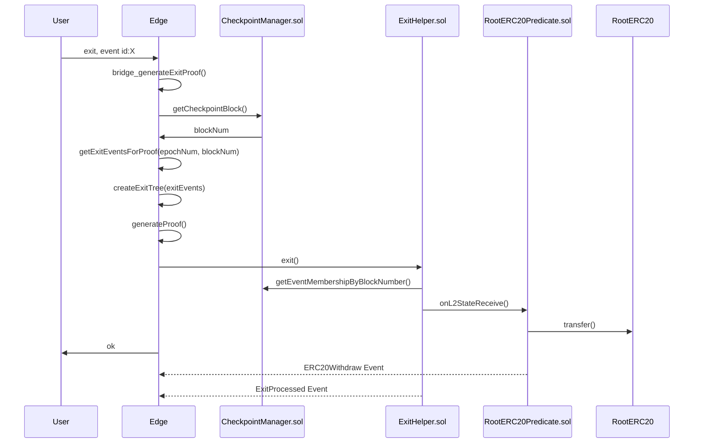

## Deposit

Bridge ERC 20 tokens from rootchain to childchain via deposit.

## Withdraw

Bridge ERC 20 tokens from childchain to rootchain via withdrawal.

## Exit

Finalize withdrawal of ERC 20 tokens from childchain to rootchain.

