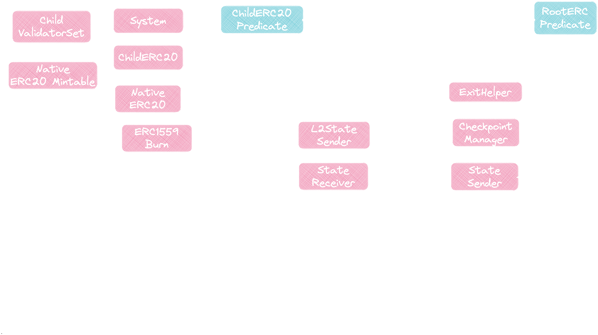

## State Transitions

In PolyBFT, the consensus protocol follows a set of state transitions that enable the network to reach consensus on the state of the blockchain. The process begins when a validator proposes adding a new block to the blockchain. This block contains a list of transactions that the validator would like to include in the next update to the blockchain's state.

Other validators in the active set will vote on whether to accept the proposed block. Each validator has a voting weight that influences voting. A super-majority of validators must agree to accept the block to reach consensus. Once a sufficient number of validators have agreed to accept the proposed block, it is added to the blockchain, and the state of the blockchain is updated to reflect the changes introduced by the transactions in the block. The protocol refers to the current block's position (the block height) as its *sequence*.

The process to finalize a block in PolyBFT is known as *sealing*. When a validator proposes a new block, other validators on the network will vote on whether to accept the block. This process is may be repeated several times; each repetition is known as a *round*. During each round, certain validators must agree to seal the proposed block for it to be added to the blockchain. Another validator will attempt to seal the sequence in the new round. If the required number of votes is not reached during a particular round, the voting process will continue into the next round, and thus, the protocol "increases the round".

Once the proposed block is accepted, it will be added to the blockchain, and the state of the blockchain will be updated to reflect the changes introduced by the transactions in the block. This process continues with the next proposer proposing a new block, and the process repeats.

## Validator Set

PolyBFT limits network participation to around 100 validators, and a variable amount of stake is used as a fixed stake criterion to limit the system's security and can make the system economically vulnerable. The validator set in the PolyBFT does not update on each block but is fixed during n block periods known as an epoch.

The `n` block period to define one epoch is determined by governance, and until then, validators will remain the same. At the end of the epoch, a special state transaction to validatorSetManagementContract is emitted, notifying the system about the validators' uptime during the epoch. It is up to the smart contract to reward validators by their uptime and update the validator set for the next epoch. There is a function getValidatorSet which returns the current validator set at any time.

## Staking

Staking is governed by staking contracts directly on Polygon. To be clear, the staking module validates on Polygon and does not rely on Ethereum's security, but in principle, two chains are securing the network, PoS client and Ethereum. Transaction checkpoints still occur on Ethereum, but Ethereum does not validate staking on Polygon.

At the end of each epoch, a reward calculation occurs to reward the active validators.

## Native Bridge Integration

PolyBFT supports an in-built bridging mechanism that enables arbitrary message passing between an Edge-powered chain and another Proof-of-Stake blockchain (rootchain) with the help of the consensus algorithm. Transfers can occur without mapping, allowing users to move assets between the two chains seamlessly.

## Slashing

Like in other Proof-of-Stake systems, validators are subject to slashing for malicious activity or poor performance. The slashing mechanics are still being determined, but PolyBFT will undoubtedly include a mechanism to penalize bad actors. Slashing a validator typically involves a penalty, such as losing some or all of their stake on the network. Examples of malicious activities are double-signing and equivocation.

## State transitions

The consensus protocol follows a set of state transitions. While things are still being finalized, the
process will typically follow the steps below.

1. A validator proposes adding a new block to the blockchain. This block contains a list of transactions
   that the validator would like to include in the next update to the blockchain's state.

A
   certain number of validators must agree to accept the block to reach consensus. 2. Other validators in the active set will vote on whether to accept the proposed block. The voting weight of
   each validator influences voting. The protocol refers to block height as a *sequence*.

    All nodes in the network exchange information for a given sequence. The process to finalize a block in PolyBFT is known as *sealing*. The sealing of blocks is instant
    and final.

    When a validator proposes a new block, other validators on the network will vote on whether to
    accept the block. This process is typically repeated several times; each repetition is known as a
    *round*. During each round, certain validators must agree to seal the proposed block
    for it to be added to the blockchain. If the required number of votes is not reached during a
    particular round, the voting process will continue into the next round, and thus, the protocol
    "increases the round". Another validator will attempt to seal the sequence in the new round.
    > The best case for a proposed block is that it is sealed at round 0. Blocks that are repeatedly
    > sealed at a high-order round usually indicates a network problem.

3. If the proposed block is accepted, it will be added to the blockchain, and the state of the blockchain
   will be updated to reflect the changes introduced by the transactions in the block.
   > If a malicious actor attempted to fork the network, they would need to obtain control of 2/3 of
   > the network, which PolyBFT prevents.

4. Once the state of the blockchain has been updated, the next proposer will propose a new block, and
   the process repeats.

IBFT limits network participation to around 100 validators. A variable amount of stake is used as a fixed
stake criterion to limit the system's security and can make the system economically vulnerable. The
validator set in the PolyBFT does not update on each block but is fixed during  `n` block periods known as
an `epoch`.

> The `n` block period to define one epoch is to be determined by governance. Until then, validators will
> remain the same. At the end of the epoch, a special `state transaction` to `validatorSetManagementContract`
> is emitted, notifying the system about validators' uptime during the `epoch`. It is up to the smart contract
> to reward validators by their uptime and **update the validator set** for the next `epoch`. There is a
> function `getValidatorSet`, which returns the current validator set at any time.

Staking is governed by staking contracts directly on Polygon. To be clear, the staking module validates on
Polygon does not rely on Ethereum's security, but in principle, two chains are securing the network, PoS
client and Ethereum. Transaction checkpoints still occur on Ethereum, but Ethereum does not validate staking
on Polygon.

!!! note
      Note that in Tendermint, an epoch is set to 1. However, PolyBFT includes the logic to set a custom epoch time, with the intent of each epoch being one day in blocks, or around 14000 blocks.

A reward calculation occurs at the end of the epoch to reward the active validators in that epoch.

!!! caution "Slashing"

      Like in other Proof-of-Stake systems, validators are subject to slashing for malicious activity or
      poor performance. Slashing a validator typically involves a penalty, such
      as losing some or all of their stake on the network. The slashing mechanics are still being determined, but PolyBFT will undoubtedly
      include a mechanism to penalize bad actors.

      Examples of malicious activities are double-signing and equivocation:

      - Double-signing refers to the act of signing two conflicting transactions. When a validator double-signs,
      it creates a situation where the network is unable to reach consensus on the state of the blockchain,
      which can lead to problems such as an attempt to fork or network instability.

      - Equivocation refers to the act of a validator attempting to create two conflicting versions of the
      blockchain, which can also lead to problems such as a fork or network instability.

## Block timestamp drift validation

In the PolyBFT consensus mechanism, an important security feature is the validation of block timestamps. This 
feature prevents malicious actors from creating blocks with timestamps far in the future, which could disrupt the 
blockchain's operation.

The block time drift validation works by checking if the block's timestamp is within a predefined time slot. If the 
timestamp is outside this window, the block is considered a future block and is rejected. This time slot is defined by 
a parameter called `blockTimeDrift`, which is nominated in seconds, and can be set during the genesis of the blockchain. 
The default value for `blockTimeDrift` is 1 second.

This feature ensures that all blocks in the blockchain have valid timestamps, preventing potential attacks and maintaining 
the integrity of the blockchain.

## Native bridge integration

With the help of PolyBFT, Edge supports an
[in-built bridging mechanism (a two-way bridge)](../../bridge/overview.md),
which enables arbitrary message passing between an Edge-powered chain and another Proof-of-Stake
blockchain (`rootchain`). Transfers can occur without mapping.

Learn more [here](../../bridge/overview.md)).
