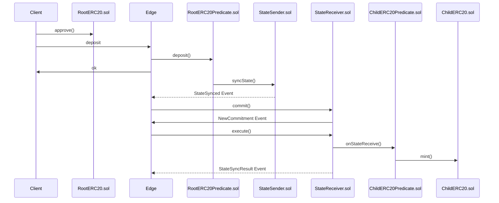
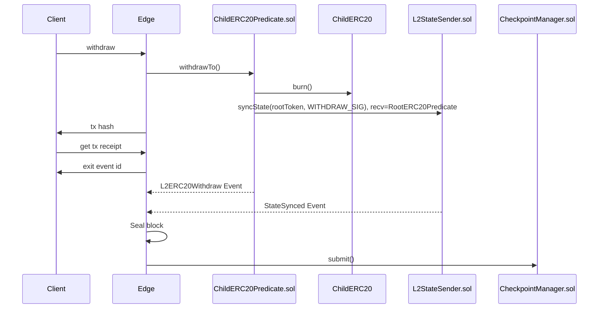
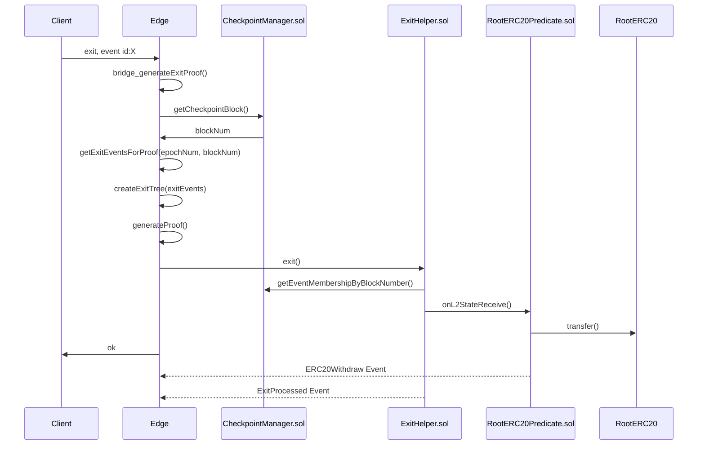

## Deposit

Bridge tokens from L1->L2 via deposit.

```mermaid
sequenceDiagram
	Client->>RootERC20.sol: approve()
	Client->>Edge: deposit
	Edge->>RootERC20Predicate.sol: deposit()
	Edge->>Client: ok
	RootERC20Predicate.sol->>StateSender.sol:syncState()
	StateSender.sol-->>Edge: StateSynced Event
	Edge->>StateReceiver.sol:commit()
	StateReceiver.sol->>Edge: NewCommitment Event
	Edge->>StateReceiver.sol:execute()
	StateReceiver.sol->>ChildERC20Predicate.sol:onStateReceive()
	ChildERC20Predicate.sol->>ChildERC20.sol: mint()
	StateReceiver.sol-->>Edge:StateSyncResult Event
```

## Withdraw

Withdraw tokens from L2.

```mermaid
sequenceDiagram
	Client->>Edge: withdraw
	Edge->>ChildERC20Predicate.sol: withdrawTo()
	ChildERC20Predicate.sol->>ChildERC20: burn()
	ChildERC20Predicate.sol->>L2StateSender.sol: syncState(rootToken, WITHDRAW_SIG), recv=RootERC20Predicate
	Edge->>Client: tx hash
	Client->>Edge: get tx receipt
	Edge->>Client: exit event id
	ChildERC20Predicate.sol-->>Edge: L2ERC20Withdraw Event
	L2StateSender.sol-->>Edge: StateSynced Event
	Edge->>Edge: Seal block
	Edge->>CheckpointManager.sol: submit()
```
## Exit

Finalize withdrawal.

```mermaid
sequenceDiagram
	Client->>Edge: exit, event id:X
	Edge->>Edge: bridge_generateExitProof()
	Edge->>CheckpointManager.sol: getCheckpointBlock()
	CheckpointManager.sol->>Edge: blockNum
	Edge->>Edge: getExitEventsForProof(epochNum, blockNum)
	Edge->>Edge: createExitTree(exitEvents)
	Edge->>Edge: generateProof()
	Edge->>ExitHelper.sol: exit()
	ExitHelper.sol->>CheckpointManager.sol: getEventMembershipByBlockNumber()
	ExitHelper.sol->>RootERC20Predicate.sol:onL2StateReceive()
	RootERC20Predicate.sol->>RootERC20: transfer()
	Edge->>Client: ok
	RootERC20Predicate.sol-->>Edge: ERC20Withdraw Event
	ExitHelper.sol-->>Edge: ExitProcessed Event
```

