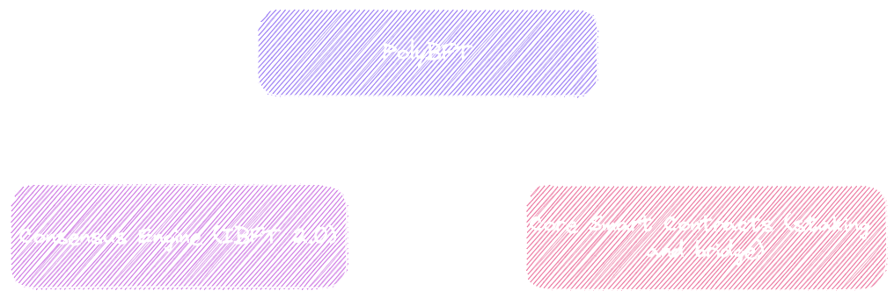
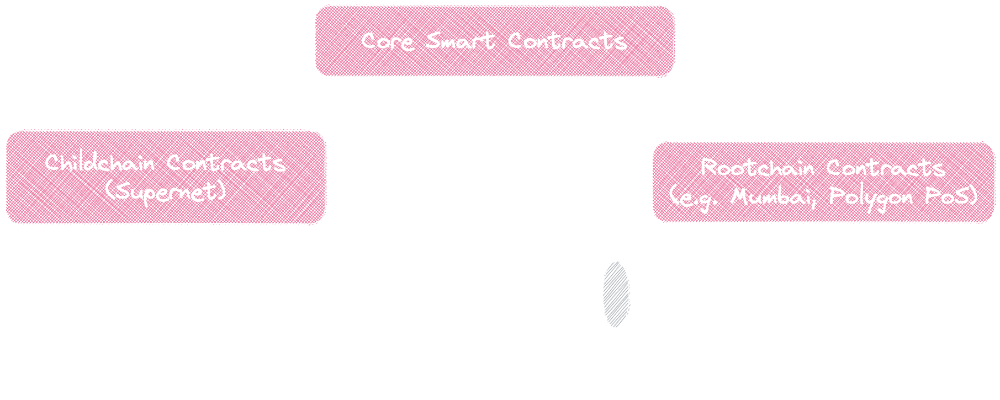

## Overview

PolyBFT is a sophisticated and robust consensus mechanism employed by Polygon Edge.
The consensus mechanism comprises two key components, a **consensus engine** and **consensus protocol**.
PolyBFT utilizes the IBFT consensus engine and a Proof-of-Stake architecture to seal blocks, provide specific network capabilities, and govern the network.
The core smart contracts work in tandem with the consensus engine to define all the network's Proof-of-Stake rules.

The consensus engine of PolyBFT is based on the Istanbul Byzantine Fault Tolerance [<ins>(IBFT 2.0) protocol</ins>](https://github.com/0xPolygon/go-ibft), which is responsible for sealing blocks on the blockchain.
The IBFT 2.0 protocol ensures that network integrity is maintained even in the presence of malicious or dishonest nodes.

To achieve fault tolerance, IBFT allows for `f` faulty nodes in a `3f + 1` network, as long as two-thirds of the nodes are honest. This algorithm is also known as a "super-majority rules" algorithm.
Each PolyBFT node maintains a local copy of the blockchain, represented as a list of blocks similar to the blockchain. The height of a block is defined as the number of parent links that separate the block from the genesis block, with the genesis block having a height of 0. Sequential instances of a block finalization protocol are run, with the objective of each instance being to determine which block is to be added at height h of the blockchain.

PolyBFT's consensus protocol is implemented through a set of core smart contracts. These contracts serve multiple purposes, including enabling staking functionality and defining an incentivization scheme for validators on the network, managing the validator set, and facilitating cross-chain communication through a native bridge.

## Bridge

The bridge transfers assets and data between an Edge-powered chain and an external EVM-compatible blockchain (rootchain), making it a critical component of the network's interoperability. Two predicate contracts, one on the childchain and one on the rootchain, implement the core bridge functionality and use the associated core contracts to deposit, withdraw, and verify cross-chain bridge transactions. The diagram above illustrates how the core contracts fit into the overall smart contract system design.
